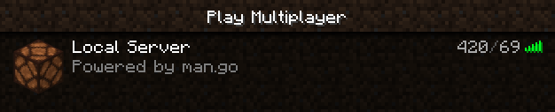

# mango
Minecraft Advanced Network in go (Minecraft Server) 

`$ go run man.go`

## Documentation
Check out the [docs](docs) for a quick overview.

## TODO
- [x] Project refactor
- [x] Status protocol
- [x] Implement error handling
- [x] Add config file
- [ ] Login protocol
  - [x] Offline
  - [ ] Online
- [x] Join game protocol
- [x] Keep Alive Packet
- [ ] Load Chunks
  - [x] (mock) Chunk Data and Update Light Packet
  - [ ] (real) Chunk Data and Update Light Packet
- [ ] Tick Worlds
- [ ] Multiplayer
  - [ ] Proper player IDs
  - [ ] Movement
  - [ ] Tab player list

## Misleading Client Side Bugs
- [Sometimes the status requests ignore the response packet and stay at "Pinging..."](https://bugs.mojang.com/browse/MC-125762)