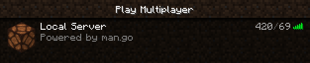

# mango
Minecraft Advanced Network in go (Minecraft Server) 

`$ go run man.go`

## TODO
- [x] Project refactor
- [x] Status protocol
- [x] Implement error handling
- [x] Add config file
- [ ] Login protocol
  - [x] Offline
  - [ ] Online
- [ ] Join game protocol

## Resources
MC Protocol: https://wiki.vg/Protocol
