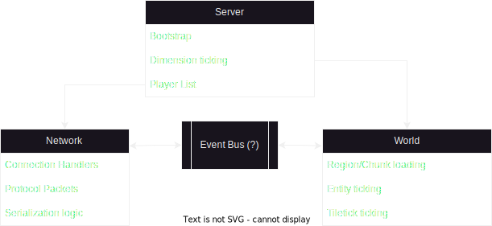

# Some context

Here's a quick guide to give other devs (and future me) the context needed to jump in and contribute to this project, things learned along the way, and so on.

### Table of Contents  
[Minecraft Protocol](#protocol)  
[Minecraft Code](#code)  
[Project Structure](#structure)  
[Non-Vanilla features](#features)  

## Minecraft Protocol
The protocol version is highly tied to the client's Minecraft version, the IDs and contents of the packets, as well as the IDs of blocks, biomes, etc.

We're working with protocol [762](https://wiki.vg/index.php?title=Protocol&oldid=18242) (Minecraft 1.19.4), though there are some projects that translate between versions such as [ViaVersion](https://github.com/ViaVersion/ViaVersion).

As for packet IDs, there's a [packet_index.md](./packet_index.md) listing the right IDs for the packets, as it's defined in-game by their declaration order in the packet registry. Something similar should be added for biomes and blocks.

## Minecraft Code
The main source of truth for this project is [wiki.vg](https://wiki.vg/index.php?title=Protocol&oldid=18242), but as there are still some outdated posts, I recommend building some modding setup such as [MCP Reborn](https://github.com/Hexeption/MCP-Reborn/tree/1.19) to check what the game is actually doing.  
(I'm probably getting hate for this one, so [Fabric](https://fabricmc.net/develop/)/[Quilt](https://github.com/QuiltMC/quilted-fabric-api) could help as well, I guess...)

## Project structure
Project structure suggestions are appreciated, as I wasn't used to go's best practices while building this thing.  
As for the next features to implement, I feel it will come down to something like this:  

## Non-Vanilla features
There are some improvements by the modding community that would be nice to implement at some point:
- [Folia's multi-threaded regions](https://docs.papermc.io/folia/reference/region-logic).
- [KCP protocol](https://github.com/xtaci/kcp-go) support (highly used by technical SMPs).
- A [metrics exporter](https://grafana.com/oss/prometheus/exporters/go-exporter) for Prometheus/Grafana (with custom metrics such as loaded chunks, players, average tick duration and so on).
